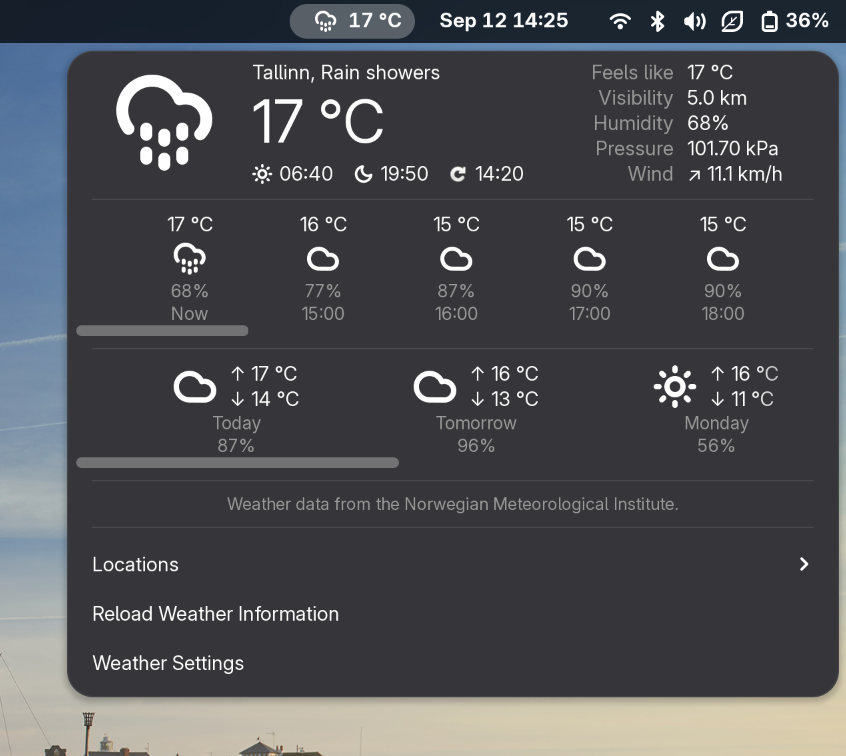

# Weather Extension



A simple GNOME Shell extension for displaying weather conditions and
forecasts, with support for multiple locations, a symmetrical layout, and a
settings window built on libadwaita.

The weather report includes forecasts for ~10 days.

**Supported GNOME Shell versions:** 49, 50

This is a fork of [Neroth/gnome-shell-extension-weather](https://github.com/Neroth/gnome-shell-extension-weather),
ported to the module system and APIs GNOME Shell has used since version 45,
and to `libgweather-4` (which dropped the `GWeather.LocationEntry` widget the
original relied on for its "add city" dialog — replaced here with a
from-scratch location search).

## Installation

1. Clone the repository:
   ```bash
   git clone https://github.com/mlkonrad/gnome-weather.git
   ```

2. Copy to your GNOME extensions directory:
   ```bash
   cp -r gnome-weather ~/.local/share/gnome-shell/extensions/gnome-weather@mlkonrad.github.com
   ```

3. Compile the settings schema:
   ```bash
   glib-compile-schemas ~/.local/share/gnome-shell/extensions/gnome-weather@mlkonrad.github.com/schemas/
   ```

4. Restart GNOME Shell and enable the extension:
   ```bash
   gnome-extensions enable gnome-weather@mlkonrad.github.com
   ```

## Configuration

Open **Weather Settings** from the panel dropdown (or `gnome-extensions prefs
gnome-weather@mlkonrad.github.com`) to add/remove locations, switch units, and
change how the panel indicator looks.

## Debug

Watch `journalctl --user` for Shell errors (search for `gnome-weather` in the
stack traces).

## License

Copyright (C) 2011 - 2026

* Christian METZLER \<neroth@xeked.com\>,
* Elad Alfassa \<elad@fedoraproject.org\>,
* Mark Benjamin \<weather.gnome.Markie1@dfgh.net\>,
* Simon Claessens \<gagalago@gmail.com\>,
* Ecyrbe \<ecyrbe+spam@gmail.com\>,
* Timur Kristóf \<venemo@msn.com\>,
* Simon Legner \<Simon.Legner@gmail.com\>,
* Mattia Meneguzzo \<odysseus@fedoraproject.org\>,
* Marlon Konrad (GNOME 45+/libgweather-4 port).

This file is part of *gnome-weather*.

*gnome-weather* is free software: you can redistribute it and/or modify it
under the terms of the GNU General Public License as published by the Free
Software Foundation, either version 3 of the License, or (at your option) any
later version.

*gnome-weather* is distributed in the hope that it will be useful, but
WITHOUT ANY WARRANTY; without even the implied warranty of MERCHANTABILITY or
FITNESS FOR A PARTICULAR PURPOSE. See the GNU General Public License for more
details.

You should have received a copy of the GNU General Public License along with
*gnome-weather*. If not, see <http://www.gnu.org/licenses/>.
